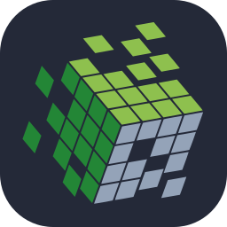
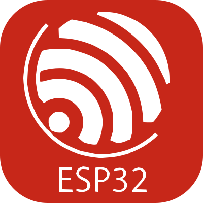

<pre>
     ██╗  ███████╗  ███╗   ███╗  ██╗  ███╗   ██╗
     ██║  ██╔════╝  ████╗ ████║  ██║  ████╗  ██║
     ██║  █████╗    ██╔████╔██║  ██║  ██╔██╗ ██║
██   ██║  ██╔══╝    ██║╚██╔╝██║  ██║  ██║╚██╗██║
╚█████╔╝  ███████╗  ██║ ╚═╝ ██║  ██║  ██║ ╚████║
 ╚════╝   ╚══════╝  ╚═╝     ╚═╝  ╚═╝  ╚═╝  ╚═══╝
</pre>

  

<picture>
  <source media="(prefers-color-scheme: dark)" srcset="https://raw.githubusercontent.com/jemin-023/jemin-023/main/dark.svg">
  <source media="(prefers-color-scheme: light)" srcset="https://raw.githubusercontent.com/jemin-023/jemin-023/main/light.svg">
  
</picture>

## Connect with me

## 🛠️ Skills

### 💻 Languages

### 📊 Data Science

  
  

### 🧠 AI & ML

### 🖥️ Operating Systems

### ⚙️ Tools & Others

  
  

### 📚 Currently Learning

---

## 🏆 Achievements

| Event | Organization | Achievement |
|--------|-------------|-------------|
| WebForge 2026 | Manipal University Jaipur | 🥉 3rd Place |
| Biothon 2026 [ India's Biggest biology hackathon ] | Marwadi University  | Finalist |

---
